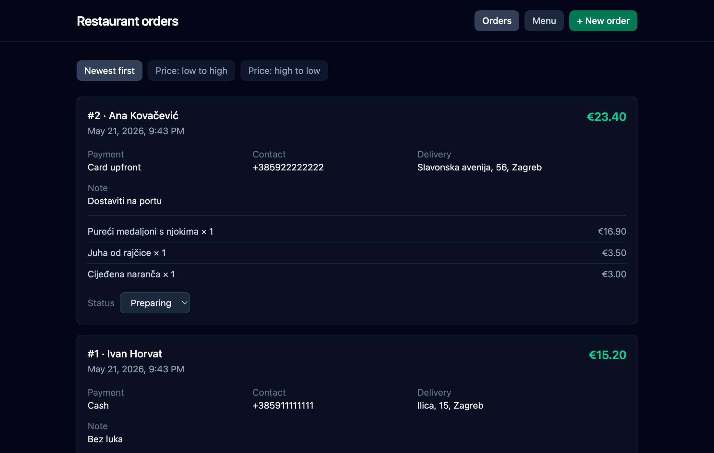
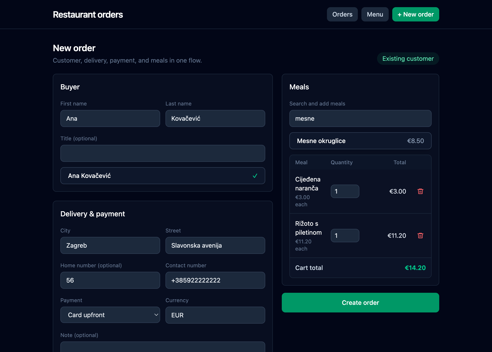
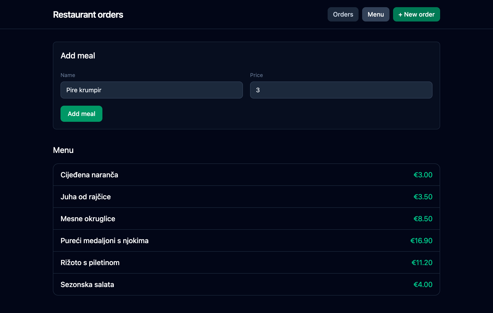

# Restaurant Orders

Spring Boot + React application for managing restaurant orders.

This is my solution for the Abysalto junior developer hiring task. It implements restaurant order management with a Spring Boot API, H2 persistence, a React frontend, request validation, integration tests, and CI checks.

## Screenshots



Orders can be reviewed, sorted by total price, and updated by status.



The new order flow supports existing customer lookup, repeat-customer defaults, delivery details, payment details, and meal selection.



The menu screen allows active meals to be listed and new meals to be added.

## Features

- Create restaurant orders with buyer, delivery, payment, note, currency, and meal lines
- Store and retrieve data from an H2 database
- Calculate order totals from menu item prices and quantities
- List orders newest-first or sorted by total price
- Update order status
- Search existing buyers while creating an order
- Prefill contact, delivery, payment, and currency from a buyer's latest order
- Manage menu items
- Swagger UI for API exploration
- Backend integration tests and GitHub Actions CI

## Design Notes

I kept the structure intentionally simple:

- controllers handle HTTP requests and responses
- managers coordinate application use cases
- repositories handle database access
- DTO records define API request and response contracts
- `OrderResponseMapper` keeps response assembly separate from order workflow logic

The code also uses constructor-based dependency injection, validation, and behavior-level tests around the main order workflows.

## Prerequisites

- Java 17+
- Node.js 20+ and npm

## Run Backend

```bash
./mvnw spring-boot:run
```

Backend URLs:

- API: `http://localhost:8080`
- Swagger UI: `http://localhost:8080/swagger-ui/index.html`
- H2 console: `http://localhost:8080/h2-console`

H2 connection:

| Field | Value |
|-------|-------|
| JDBC URL | `jdbc:h2:mem:restaurant-orders` |
| User | `sa` |
| Password | empty |

### Authentication

HTTP Basic auth is enabled for API routes:

| Username | Password |
|----------|----------|
| `user` | `password` |

Swagger UI and H2 console are available without authentication.

## Run Frontend

```bash
cd frontend
npm install
npm run dev
```

Open:

```text
http://localhost:5173
```

The Vite dev server proxies API requests to the Spring Boot backend. Start the backend first.

Production build:

```bash
cd frontend
npm run build
```

## API Overview

### Orders

| Method | Path | Description |
|--------|------|-------------|
| `GET` | `/orders` | List orders |
| `GET` | `/orders?sort=totalPrice` | List orders by total price ascending |
| `GET` | `/orders?sort=-totalPrice` | List orders by total price descending |
| `GET` | `/orders/{orderNr}` | Get one order |
| `POST` | `/orders` | Create order |
| `PATCH` | `/orders/{orderNr}/status` | Update order status |

### Buyers

| Method | Path | Description |
|--------|------|-------------|
| `GET` | `/buyers/search?firstName={value}&lastName={value}` | Search buyers |
| `GET` | `/buyers/{buyerId}/order-defaults` | Get defaults from buyer's latest order |

If a buyer has no previous orders, `/buyers/{buyerId}/order-defaults` returns `204 No Content`.

### Menu

| Method | Path | Description |
|--------|------|-------------|
| `GET` | `/menu-items` | List active menu items |
| `GET` | `/menu-items/search?name={value}` | Search menu items |
| `POST` | `/menu-items` | Create menu item |

Example:

```bash
curl -u user:password http://localhost:8080/orders
```

## Tests

Run backend tests:

```bash
./mvnw test
```

Run frontend build check:

```bash
cd frontend
npm run build
```

The backend test suite covers core order workflows, validation, sorting, status updates, and buyer order defaults.

## CI

GitHub Actions runs on push and pull request:

- backend: `./mvnw test`
- frontend: `npm ci` and `npm run build`

Workflow file: `.github/workflows/ci.yml`
